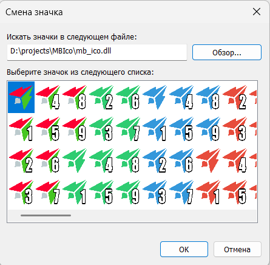

# MoonbotIco

Скрипт на Python для автоматической генерации цветовых вариаций иконок (`.ico`) с цифрами и их последующей упаковки в единый файл `.dll` для Windows.



> **Решение из коробки:** Готовый файл `mb_ico.dll` (со всеми цветами и цифрами, как на картинке) уже добавлен в репозиторий. Вы можете просто скачать его и сразу начать использовать для своих папок и ярлыков, не запуская скрипт.

## Возможности скрипта
1. Принимает базовую иконку (извлекает слой `256x256`).
2. Окрашивает оригинальную иконку в заданный разработчиком список цветов (сохраняя альфа-канал и прозрачность).
3. Создает цифровые оверлеи (цифры от 1 до 9 в заданном шрифте и стиле) и накладывает их на оригинальную иконку и её цветные вариации.
4. Создает пустой `.dll` файл средствами встроенного компилятора C# (`csc.exe`) от .NET Framework.
5. Инжектит все получившиеся вариации иконок в созданный `.dll`, используя `win32api` ресурсы, с правильной нумерацией групп `RT_GROUP_ICON` - в итоге иконки сразу готовы для использования в Windows.

## Требования
- **ОС**: Windows (скрипт использует `csc.exe` и `win32api` для работы с DLL ресурсами)
- **Python**: 3.8 или выше

Из-за использования Windows API, скрипт не предназначен для запуска на Linux / macOS.

## Установка

1. Склонируйте конфигурацию.
2. Создайте и активируйте виртуальное окружение:
   ```bash
   python -m venv venv
   .\venv\Scripts\activate
   ```
3. Установите зависимости:
   ```bash
   pip install -r requirements.txt
   ```
   *Зависимости включают `Pillow` (для обработки изображений) и `pywin32` (для работы с Windows ресурсами).*

## Настройка

В начале файла `main.py` расположен блок конфигурации `================= КОНФИГУРАЦИЯ =================`, в котором можно гибко настроить генерацию:

- `INPUT_ICO` - Имя входного ICO-файла, на основе которого собирается библиотека.
- `OUTPUT_DLL` - Имя желаемой DLL-сборки на выходе.
- `TARGET_COLORS` - Словарь желаемых цветов (имя и HEX кортеж), в которые должна быть окрашена базовая иконка. Учитывается альфа-канал (прозрачность).
- `FONT_CONFIG` - Тонкая настройка шрифта цифр (от размера и цвета заливки до сжатия по ширине и обводки).

## Запуск
После того как вы настроили `main.py` и положили рядом исходную иконку (по умолчанию `mb.ico`):

```bash
python main.py
```

В консоли будет отображаться процесс генерации и упаковки:
```text
Извлечение базы 256x256 из оригинальной иконки...
Создание цифровых оверлеев...
Добавление оригинальной иконки и её версий с цифрами...
Применение цветов и цифр, создание ICO буферов...
Упаковка 160 иконок в DLL...
[УСПЕХ] DLL собрана: mb_ico.dll. Итого групп: 160
Обработка завершена! Все операции выполнены в памяти.
```

В результате в каталоге проекта появится рабочий `mb_ico.dll`, в котором будут находиться все сгенерированные иконки.
